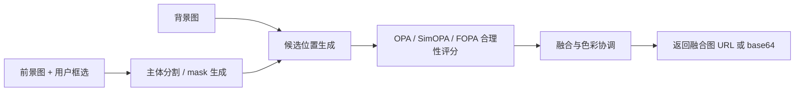

# 智能物体融合网页原型

这是一个静态前端原型，用来演示“前景上传 + 主体框选 + 背景上传 + 合理放置 + 融合下载”的交互流程。页面风格参考 Pageflows 的清晰流程、卡片化工作区和简洁控制面板。

## 现有功能

- 拖拽、点击或键盘选择上传第一张图片作为前景来源。
- 在第一张图片上框选人像或主要物品。
- 优先调用浏览器端背景移除模型，对框选区域生成清晰透明 PNG。
- 对抠图结果做小缺口修补，自动补回目标物内部被误删的小块区域。
- 下载单独的前景抠图结果。
- 抠图结果不满意时，可一键返回原图并重新框选。
- 上传第二张图片作为背景图。
- 自动推断主体尺寸、放置位置和阴影强度。
- 生成融合图，并给出模拟 OPA 合理性评分。
- 下载生成的 PNG 图片。

## 模型接口

模型接口不显示在网页上，配置集中放在 `app.js` 顶部：

```js
const MODEL_CONFIG = {
  useRemoteModel: false,
  endpoint: "http://localhost:8000/api/compose",
  requestTimeoutMs: 30000,
  useBrowserCutoutModel: true,
  cutoutLibraryUrl: "https://cdn.jsdelivr.net/npm/@imgly/background-removal@1.7.0/+esm",
  repairSmallCutoutHoles: true,
  maxRepairHoleRatio: 0.035,
  minSolidAlpha: 96,
};
```

`useBrowserCutoutModel` 为 `true` 时，浏览器会在第一次抠图时按需加载背景移除库及必要模型文件；若网络或模型加载失败，页面会退回到本地启发式抠图，保证流程仍能跑通。

`repairSmallCutoutHoles` 会在模型抠图后检查透明区域：如果某个透明区域不连接图片边缘，且面积较小，就认为它可能是目标物被误删的一部分，并用周围前景像素自动补回。这个修补只处理小缺口，避免把真正背景错误填入。

当 `useRemoteModel` 改为 `true` 时，前端会调用：

```text
POST /api/compose
```

建议后端拆成三个阶段：



## 与 OPA 思路的对应关系

参考仓库：<https://github.com/bcmi/Object-Placement-Assessment-Dataset-OPA>

OPA/SimOPA 的重点是判断物体放置是否合理，考虑位置、尺寸、遮挡、语义和透视等因素。当前前端先用模拟评分跑通流程，后续可以把候选位置的合成图和前景 mask 送入本地模型服务或华为云服务，由服务返回评分最高的位置、尺寸、阴影和最终融合图。

## 运行方式

直接在浏览器打开 `index.html` 即可。若之后接后端服务，可以使用任意静态服务器托管本目录。
